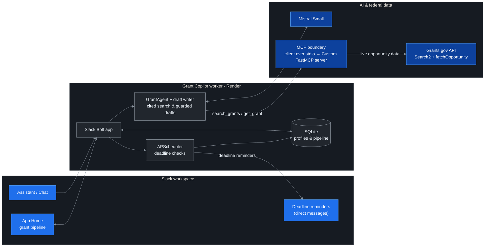

# Grant Copilot

Grant Copilot is a Slack agent that helps resource-constrained nonprofits find profile-matched U.S. federal grants, track deadlines, and prepare a first-pass Project Summary without leaving Slack.

Built for the **Slack Agent Builder Challenge**, track **Slack Agent for Good**.

## Who it is for

Small nonprofit staff and volunteers often have limited grant-operations capacity. Finding a promising opportunity is only the first step: they still need to screen high-level fit, organize the work, and avoid missed deadlines across more than [1,000 federal grant programs](https://www.grants.gov/support/about-grants-gov).

Grant Copilot turns that fragmented process into one focused workflow:

- **Discover** - describe a mission in the Assistant pane; the agent searches live Grants.gov data and explains why each result may fit.
- **Pre-screen** - save an organization profile with applicant type and focus areas; deterministic Grants.gov filters produce a profile-matched shortlist.
- **Track** - save opportunities to a personal App Home pipeline (`To apply`, `In progress`, `Submitted`) and receive a DM reminder near a deadline.
- **Prepare** - generate a first-pass Project Summary from the organization mission and the opportunity description for human review.

## Why Slack

Slack is already where many nonprofit teams coordinate programs and deadlines. Grant Copilot uses native surfaces for each step: the Assistant pane for discovery, Block Kit for actionable results, App Home for the pipeline, modals for profile and draft workflows, and DMs for proactive reminders. The result is a lightweight grant-operations layer inside the daily workspace rather than another disconnected tab.

## How it works



Three design decisions improve reliability:

1. **During the search step, the model controls only the keyword.** Applicant-type and funding-category filters are injected deterministically from the saved profile when the MCP tool executes, so the model cannot silently alter them.
2. **Grant access is isolated behind MCP.** The standalone server exposes `search_grants` and `get_grant`; both discovery and draft grounding use the same testable boundary.
3. **Model output is constrained.** Curation accepts only live-search IDs accompanied by an exact synopsis excerpt, and every result links back to its official Grants.gov record.

## Safeguards and limitations

- Results are **profile-matched pre-screening, not an eligibility determination**. Applicants must read the complete Notice of Funding Opportunity and confirm all requirements on Grants.gov.
- Grant Copilot does not submit applications or replace legal, financial, compliance, or grant-professional advice.
- Fit explanations and generated drafts may be incomplete or inaccurate. The drafter is instructed to mark missing facts as `[NEEDS INPUT: ...]`, but all output remains unverified and must be reviewed against the official NOFO before use.
- The current prototype covers public U.S. federal opportunities from Grants.gov, not state, local, foundation, or international funding.
- Source data can change after retrieval; the linked Grants.gov record is authoritative.
- Deadline reminders require the application and scheduler to remain online and should not be the user's only deadline control.

## Data and privacy

- **Stored locally in SQLite:** Slack user ID; organization mission, applicant type, and focus areas; saved grant ID, title, agency, deadline, URL, pipeline status, save time, and reminder state.
- **Sent to Mistral:** the user's search request, organization mission, and relevant public grant metadata for keyword selection and curation; for drafting, the mission plus the opportunity title, agency, and description.
- Applicant-type and focus-area filter codes are applied by the application and are not exposed to the model as tool arguments. Slack user IDs are not sent to Mistral.
- Assistant messages and generated drafts are not persisted by this application. App Home lets a user permanently delete the stored profile and saved-grant pipeline.
- Do not enter confidential, personal, or regulated information into the mission or search prompt. Use of Slack, Mistral, and Grants.gov remains subject to their respective terms and privacy policies.

**Required Grants.gov attribution:** This product uses the Grants.gov API but is not endorsed or certified by the U.S. Department of Health and Human Services. See the [Grants.gov API terms](https://www.grants.gov/api/terms-conditions).

## Project structure

```text
src/grant_copilot/
  mcp_server.py   MCP tools: search_grants and get_grant
  agent/          Mistral orchestration, curation, and draft writer
  domain/         Models and repository interfaces
  grants/         Grants.gov client, mapper, and facet taxonomy
  infra/          SQLite repositories and reminder scheduler
  slack/          Assistant, App Home, Block Kit, actions, and modals
```

## Stack

Python 3.14 | uv | Slack Bolt (Socket Mode) | MCP / FastMCP | Mistral Small | SQLite | APScheduler

## Setup and run

1. Install dependencies:

   ```bash
   uv sync
   ```

2. Create a Slack app from `manifest.json`, enable Socket Mode, install it in a Slack Developer Program sandbox, and collect the bot token (`xoxb-...`) and app-level token (`xapp-...`).

3. Copy `.env.example` to `.env` and set `SLACK_BOT_TOKEN`, `SLACK_APP_TOKEN`, and `MISTRAL_API_KEY`. For deployment, set `GRANT_COPILOT_DB` to a path on a persistent volume.

4. Start the app:

   ```bash
   uv run grant-copilot
   # Equivalent: uv run python -m grant_copilot
   ```

Then open Grant Copilot in Slack: use the **Assistant** pane to search and the **Home** tab to manage the profile and pipeline.

## Tests

Run the automated suite:

```bash
uv run pytest
```

Run integration smoke tests:

```bash
uv run python scripts/spike_grants_gov.py "clean water"  # Public API, no key
uv run python scripts/spike_mcp_client.py                 # MCP round trip
uv run python scripts/spike_mistral_tools.py              # Requires MISTRAL_API_KEY
```

## Deployment and judge checklist

- [ ] Run `uv run pytest` and all applicable smoke tests.
- [ ] Deploy one always-on application instance with a persistent SQLite path.
- [ ] Confirm Slack Socket Mode reconnects and Mistral quota is sufficient for judging.
- [ ] Exercise the full path as a fresh member: profile, search, save, pipeline move, reminder, and draft.
- [ ] Keep test data fictional and free of confidential information.
- [ ] Install the working app in the submitted Slack developer sandbox.
- [ ] Invite `slackhack@salesforce.com` and `testing@devpost.com` as **Members**, not Guests, and verify access.
- [ ] Include the sandbox URL, English project description, impact statement, and exported architecture diagram in Devpost.
- [ ] Publish a public demo video under three minutes and verify it in a signed-out browser.
- [ ] Keep the deployed app available throughout the judging period.
